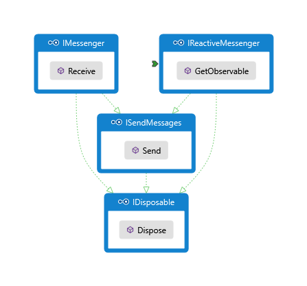

# eshopworld-messaging

A very lightweight extension to Azure Service Bus queues and topics that abstracts consuming applications
from the Bus or the Channel technology stack.
Currently it only extends queues, so the only thing you can send and receive are messages.
Topics with pub/sub is on the roadmap.

## How does it work?

The package contains 3 major public interfaces:



They all expose the same `Messenger` object, but instead of exposing the full API surface, the interfaces
are segregated for individual specific needs.

If you just want to send messages, consume `ISendMessages`.

If you want to send and receive with a simple call back interface use the `IMessenger`.

If instead you want a reactive IObservable that you can then plug into a reactive pipeline, use the `IReactiveMessenger`.

### What are these messages that I send and receive?

They are simply [POCOs](https://en.wikipedia.org/wiki/Plain_Old_CLR_Object) that implement IMessage.
The interface was preferred over a base class (at the cost of a lookup mechanism) to allow for
very thin messages that can be multi-purpose POCOs, for example a POCO that can go to a queue
can also go into an IDbSet and be persisted by EF or be converted to `JSON` and sent through the wire as a
response object from an MVC `WebApi` Controller.

It's on the roadmap to use `DataAnnotations` to validate messages during send, so the same validation
model can be used across mapping frameworks.

Here's a message example from the integration tests:
```c#
public class TestMessage : IMessage
{
    public string Name { get; set; }

    public string Stuff { get; set; }

    public float Price { get; set; }
}
```

### How should I handle these messages?

The simplest way to do it is by consuming IMessenger and calling `Receive`:
```c#
IMessenger msn = new Messenger("SB CONNECTION STRING"))

msn.Receive<TestMessage>(async m =>
{
    await m.Lock();

    // do something with it

    await m.Complete();
});
```

You can call `Lock`, `Abandon`, `Complete` and `Error` on a `IMessage`. They are written as `IMessage`
extension methods to ensure message thinness.

`Lock` will create a perpetual Lock renewal timer on the message, currently there is no support for kill switches.

`Abandon` will abandon the message, returning it to the original queue.

`Complete` will actually perform the "Read" on the message taking it from the queue.

`Error` will move the message to the error queue, used during critical processing errors where you know right
away that you can't process the message due to either validation, business rules, incorrect data, etc.
